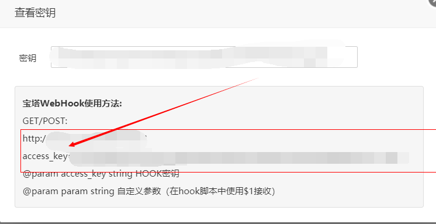
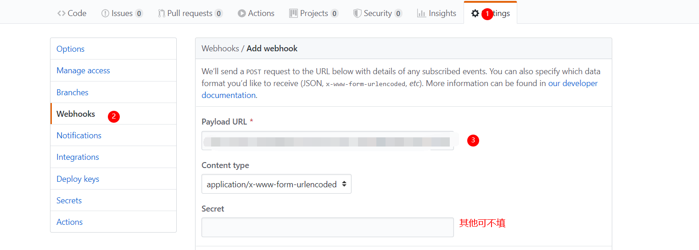

​	我们在务器上使用宝塔进行操作,使用宝塔比较直接,可视化,各种操作和安装东西很方便(如果只是想安装一些东西,快速搭建),后面也会继续使用宝塔为网站安装`https`证书,使用` Let's Encrypt `

申请免费的证书并配置

<!--more-->

首先在软件商店搜索`webhookl`安装,添加,名称自定以,执行脚本根据下面的自己更改

```sh
#!/bin/bash
 

echo ""
#输出当前时间
date --date='0 days ago' "+%Y-%m-%d %H:%M:%S"
echo "Start"
#判断宝塔WebHook参数是否存在
if [ ! -n "$1" ];
then 
          echo "param参数错误"
          echo "End"
          exit
fi
#git项目路径
gitPath="/你的路径/$1"
#git 网址
gitHttp="https://gitee.com/你的地址/$1.git"
echo "Web站点路径：$gitPath"
#判断项目路径是否存在
if [ -d "$gitPath" ]; then
        cd $gitPath
        #判断是否存在git目录
        if [ ! -d ".git" ]; then
                echo "在该目录下克隆 git"
                sudo git clone $gitHttp gittemp
                sudo mv gittemp/.git .
                sudo rm -rf gittemp
        fi
        echo "拉取最新的项目文件"
        #sudo git reset --hard origin/master
        sudo git pull        
        echo "设置目录权限"
        sudo chown -R www:www $gitPath
        echo "End"
        exit
else
        echo "该项目路径不存在"
                echo "新建项目目录"
        mkdir $gitPath
        cd $gitPath
        #判断是否存在git目录
        if [ ! -d ".git" ]; then
                echo "在该目录下克隆 git"
                sudo git clone $gitHttp gittemp
                sudo mv gittemp/.git .
                sudo rm -rf gittemp
        fi
        echo "拉取最新的项目文件"
        #sudo git reset --hard origin/master
        sudo git pull
        echo "设置目录权限"
        sudo chown -R www:www $gitPath
        echo "End"
        exit
fi
```

修改完成后到github的项目仓库里,`setting`里的`webhooks`将宝塔生成的密匙的`url`添加进去





测试

更改`hexo`的一些内容,查看`travisci`部署情况,部署完成查看服务器的仓库是否更新