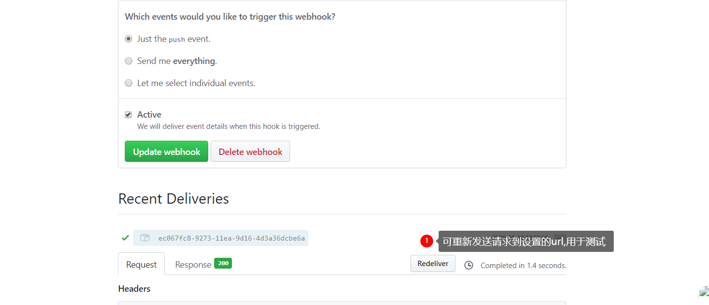

 我们在务器上使用宝塔进行操作,使用宝塔比较直接,可视化,各种操作和安装东西很方便(如果只是想安装一些东西,快速搭建),后面也会继续使用宝塔为网站安装`https`证书,使用`Let's Encrypt`

申请免费的证书并配置

<!--more-->

首先在软件商店搜索`webhookl`安装,添加,名称自定以,执行脚本根据下面的自己更改

```sh
#!/bin/bash
 

echo ""
#输出当前时间
date --date='0 days ago' "+%Y-%m-%d %H:%M:%S"
echo "Start"
#判断宝塔WebHook参数是否存在
if [ ! -n "$1" ];
then 
          echo "param参数错误"
          echo "End"
          exit
fi
#git项目路径
gitPath="/www/wwwroot/$1" //自己的网站根目录
#git 网址
gitHttp="git@xxx.com:name/$1.git" //此处的变量我设置为了自己的github仓库名
echo "参数: $1"
echo "Web站点路径：$gitPath"
echo "git仓库: $gitHttp"
#判断项目路径是否存在
if [ -d "$gitPath" ]; then
		echo "目录存在并进入目录wwwroot"
		cd /www/wwwroot/
		echo "重新克隆到hexo文件夹"
		git clone git@xxx.com:name/$1 ./hexo
		echo "设置hexo目录组合拥有者"
		sudo chown -R www:www ./hexo
		echo "设置hexo目录权限"
		sudo chmod -R 755 ./hexo
		
		echo "克隆完成回到/www/wwwroot/"
		cd /www/wwwroot/
		echo "删除原仓库"
        sudo rm -r ./$1
		echo "替换为hexo仓库"
		sudo mv ./hexo ./$1
		echo "设置目录组合拥有者"
        sudo chown -R www:www $gitPath
        echo "设置目录权限"
		sudo chmod -R 755 $gitPath
        echo "End"
        exit
else
        echo "该项目路径不存在"
        echo "新建项目目录"
        #sudo mkdir $gitPath
        cd /www/wwwroot/
        echo "克隆最新的项目文件"
		git clone git@github.com:ayuayue/ayuayue.github.io.git
        #sudo git reset --hard origin/master
        #git pull
		echo "设置目录组合拥有者"
        sudo chown -R www:www $gitPath
        echo "设置目录权限"
		sudo chmod -R 755 $gitPath
		cd $gitPath
		git checkout master
        echo "End"
        exit
fi
```

修改完成后到 github 的项目仓库里,`setting`里的`webhooks`将宝塔生成的密匙的`url`添加进去


**注意**

这一步`url`的`param`不一定要跟宝塔一样,这个就是脚本里的`$1`变量,这个脚本是把自己的仓库名设置为了`param`,也就是把上面图最后的`aaa`改为了`resp_name`.


测试
_注意_
不要在宝塔里测试,去`github`仓库里发请求


更改`hexo`的一些内容,查看`travisci`部署情况,部署完成查看服务器的仓库是否更新
