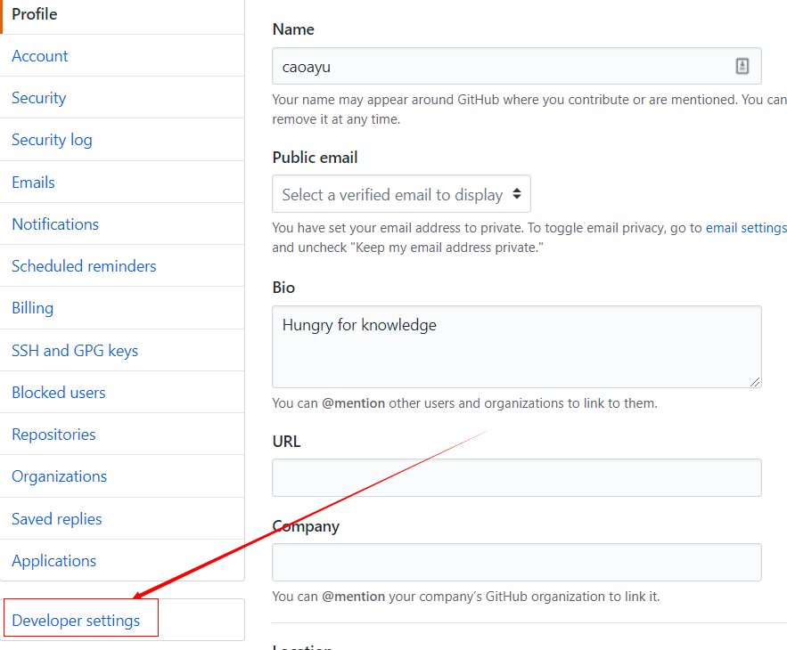
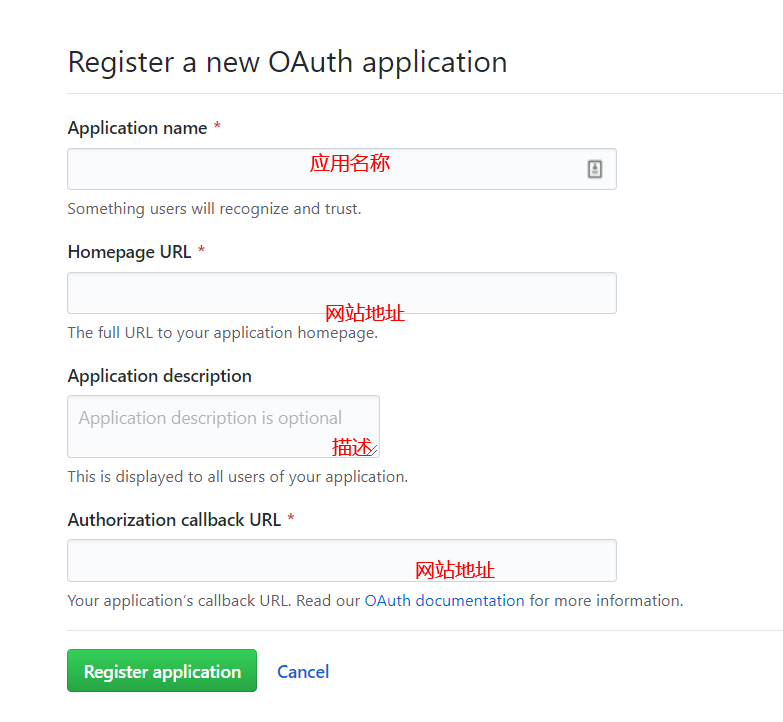
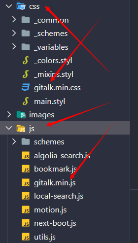

​	*所有操作再`hexo next`主题的基础上完成*

> 准备工作:
>
> 1. 新建一个`github`仓库,使用`issues`作为评论容器
> 2. 注册`gitalk`,获取`id`,`secret`
> 3. 给页面增加`gitalk`元素及引入`gitalk`样式表及`js`文件

<!--more-->

开始:

1. 先新建一个仓库,名为`blogtalk`,默认开启了`issues`功能,不用再设置

2. 创建一个  `OAuth Apps`,进入`github`的个人设置页面

   


#### `new OAuth App`



拿到`id`跟`secret`

3. 加入页面元素,并修改配置文件

   先加入`div` 容器


为了加速`css`及`js`文件的加速并且防止`cdn`链接出现问题而导致评论无法使用的情况,将`cdn`的`css,js`文件下载到本地使用

```html
  # Gitalk
  # gitalk_js: //cdn.jsdelivr.net/npm/gitalk@1/dist/gitalk.min.js
  # gitalk_css: //cdn.jsdelivr.net/npm/gitalk@1/dist/gitalk.min.css
```

将上面的两个文件下载下来保存到主题文件夹下的`css,js`文件夹下



修改布局文件中的`gitalk`,修改资源的加载路径


最后一步,修改配置文件


```
hexo clean && clean g && clean s
//重新生成静态文件即可看到效果
//或者 git push到github仓库使用上篇的自动部署
```

